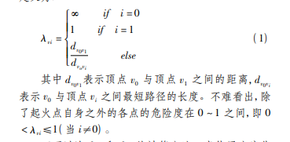

# Time to leave the Louvre

1. 用迪杰斯特拉算法求出某一个人距离逃生门的距离
2. 个人心理因素
3. 从众心理
4. 障碍物与墙的影响

## 数据

capacity：过道（楼梯）宽度*过道（楼梯）长度：可以以人为单位

每个展厅的capacity，**日常人流量**，最好能虚拟出一个当前该展厅的人数（可能有技术进行检测否？）

发生特殊情况的地点的危险因数（这个需要列公式）

## background

恐怖袭击经常发生啊，卢浮宫很重要啊，一堆人去啊，游客不听话啊，尽管恐怖袭击经常发生，也没有很好的逃生指导（还是什么来着，那个新闻，反正安保措施不到位）

## 最快疏散

最快的疏散应该是找到一条最佳的疏散路径引用逃生速度的文献（但是是中文的，需要从中文文献中提取英文文献，或者自己把它算一遍，个人认为后者没必要）

。且能使用户以最安全、最迅速的方式离开危险地域，离开卢浮宫。而最佳疏散方案应该综合考虑当前位置与出口的距离以及该路径的安全程度。引用：Taniguchie E． ，Shimamoto H． Intelligent Transportation System Based on Dynamic Vehicle Routing and Scheduling with Variable Travel Times［J］． Transportation Research Part C，2004，( 12) :
235-250．

## 元宝鸡（CA）元胞机

## 危险系数的计算

各个顶点的危险度应该与距离危险发生位置的距离成反比，因为距离越远越安全。

从当前位置到出口的危险系数应该是途经的各个顶点的危险程度的sum，即
$$
\lambda_{jk}=\sum_{i=j}^{k}{\lambda_{vi}}
$$

## 迪杰斯特拉算法

单源最短路径，根据图论得到离这个人最近的出口，这个最近的标准结合了距离、容量是否可承载以及尽量离危险地带远。

## 无监督机器学习

决定了人的行走方向，设置一个奖励值S
$$
S=\alpha*危险系数/\beta*到门口的距离
$$

## special case

* 展厅的游客分布不平均，尤其是镇馆三宝的展馆，会有非常多的人，并且可能有门，会卡门

* 那些个只有博物馆知道的小门，从那里出会有安全问题，要不要考虑

* 恐怖袭击的袭击者移动很快速，需要模拟被摧毁的节点的更新

* 存在恐怖袭击的地点的疏散？会不会被歹徒堵门

* 主入口比较大，可能要考虑出口的大小

* 会有踩踏事件

* 会有不听话的乱跑

* 会有残疾人，聋哑人，不知道该往哪里跑

* 还有进入大楼的救援人员，要留出安全通道

