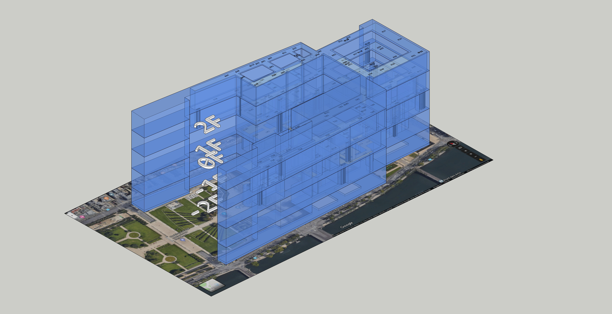
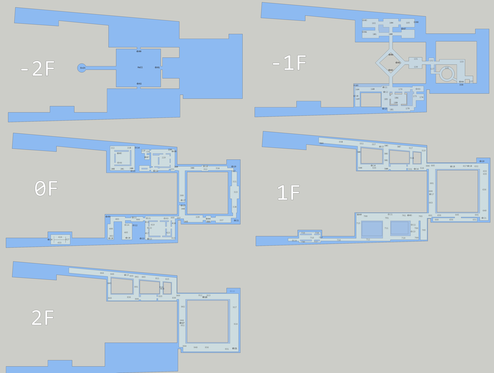

### Summary

​	安防问题在当今时代显得越来越重要，为此我们展开了对卢浮宫在各种紧急情况下 的人员疏散工作进行了探讨和模拟。卢浮宫有近2000名工作人员，超过半数以上是安保人员[Security Officer](https://www.louvre.fr/en/security-officer)[1],当紧急事件发生时、他们将成为安全的保卫者，如何在尽可能短的时间内疏散人员到安全的地方显得至关重要。

​	我们将游客疏散至安全区域的时间作为优化目标和量度，通过获取的信息和假设产生的元胞机模拟[信息摘要引用]，我们成功的发现了工作人员在通过动态计算的策略指引下可以提升在有限空间下的人员疏散能力，相比固定疏散方法时间缩短了（）。[结论引用]

​	当灾难发生时，对游客的引导方式有：

 	1. 现场的工作人员引导
 	2. 区域广播引导
 	3. 在线应用程序‘affluences’引导

​	疏散场景的模拟不遵循单一或固定规则因而具有复杂性，我们使用带有权重和长度的边和带有权重和容量的节点来描述卢浮宫的场景信息，将人作为元胞进行模拟，我们使用了若干属性产生了一系列不同质的元胞，，这些信息都体现在了我们的参数表中[参数表]，这有利于在模拟系统中接近真实系统。

​	由于卢浮宫博物馆的特殊性，它在时间上和空间上的人流量呈现出一定的潮汐性、比如2017年接待游客超过810万人次。我们的模型通过策略更改熔断机制来保证我们生成的疏散方案能够对当下场景做到自适应并且策略变更的频率在合理范围之内。

​	对一个复杂体系，输入决定输出的“机械论”并不可取，我们的模型对输入的宽容度做了优化，能够保证在输入信息有较大误差的情境下仍然能保证相对良好的策略输出。根据我们的测试结果，我们的模型能够允许在（）的误差内保证逃生时间的评估差距不大于（）。

​	寻找复杂问题的最优解具有困难性，疏散策略的需求之一就是在尽可能短的时间内产生尽可能好的效果。通过一定量的同步实验我们发现我们的平均误差在（）左右。

​	此外，出了常客出入口之外，卢浮宫还有一些服务门、员工入口、VIP入口、紧急出口和君主制建造的旧秘密入口等，只有应急人员和博物馆官员才知道实际可用的出口点总数。由于此类出入口不是为游客日常进出和逃生设计的，一般情况下不会向游客开放这些出入口，为了保证安全，这些出入口将被用于输入营救人员和在工作人员控制下的游客疏散。

​	

## 参数表

### 度量衡:SI

### 全局

*   $SECOND\_PER\_FRAME$:每帧秒数
*   $clockCount$:时钟计数
*   $savedPopulation$:出逃人数
*   $score$:评估分

### 房间

*   $roomID_i​$:房间唯一标识号

*   $roomCapacity_i$:房间的容量(人)（由面积计算）
*   $roomFloor_i$:房间所在的楼层数

### 道路

*   $roadID_i​$:道路唯一标识号
*   $roadCapacity_i$:道路容量（人）
*   $roodNode​$:道路两端连接节点

### 楼梯

*   $stairID_i$:楼梯唯一标识号
*   $stariCapacity$:楼梯容量
*   $stairLength_i$:楼梯长度

### 人

*   $uuid_{i}$:人唯一标识号

*   $speed_i$:速度
*   $position$:位置（位于哪个个容器内）
*   $positionOnRoad_i$:如果位于道路上，则记录在道路的位置（直接比照节点字符串值，小号为0起点）
*   $psychologyValue_i$心理指标
*   $t_i$:出逃时间

### 人群

*   $gID_i$:人群标识号
*   $gSpeed_i$:群体速度
*   $gPosition_i$:群体位置
*   $gCount_i$:人群数
*   $gDissociationProbability$:解离概率

### 险情

*   $dCase$:险情类型
*   $dPosition$:险情原生发生位置
*   $dTrend$:险情流动趋势

### 非游客通道

*   $uID_i$:非游客通道唯一标识号
*   $uCapacity$:非游客通道容量

## 初始化

 1.    建筑信息的初始化：

        	1. 我们通过google地图和 其自带的比例尺截取了卢浮宫的外形轮廓。.png)
        	2. 在卢浮宫介绍手册的帮助下（手册引用louvre-plan-information-english.pdf），我们使用了三维建模工具在地图的基础上进行了房间分布还原

 2.    人流信息的初始化：

       

 3.    险情信息的初始化：

       

## 评估公式

我们考虑了三种评估公式

1.  将最后一个人的逃出时间作为评估模型的度量值

    $$score=t_i,(i=max(t_i))$$

    *   优点：能优化最后一个人的出逃时间，增加了无伤亡情况的可能性
    *   缺点：
        1.  不能让总体人员在尽可能短的时间内出逃
        2.  可能有人员会陷入断路而无法逃出的情况，此时无法统计

2.  $$score=\sum_{i}t_i$$

    *   优点：能兼顾逃生的整体时间
    *   缺点：
        1.  不能保证无伤亡的可能性尽可能小
        2.  在不同的时间$t$单位时间的价值$\Delta t$不等

3.  $$score=\sum_{i}(t_{i})^k$$

    *   优点：
        1.  考虑了不同的时间$t$单位时间的价值$\Delta t$不等
        2.  能将综合损失降低到最小
    *   缺点：无法直接提升无伤亡情况的可能性

# 引用

1.  Security Officer:https://www.louvre.fr/en/security-officer